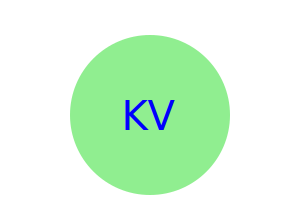

# Logo-SVG

## Description
This application serves as a direct device to create simple logos that are rendered by user input received from a few prompts.

It utilizes inquirer to prompt the user.

This application also comes with simple tests to be sure it is functioning correctly.

## Technologies Used

Built with use of Node.js, utilizes inquirer v8.2.4, and file system module. Tests done with jest v29.5.0 

## Installation
From within the folder of the application, install node.js v20.
> npm init -y
Will start node package manager.
>npm i inquirer@8.2.4
>npm i jest
Will install dependencies.
>node index.js
Will run application and begin to offer prompts for logo design.

this video illustrates the functions
https://drive.google.com/file/d/1mguZlWXfaVLveRlBZEAnSfXNySwAx09G/view

 This is the resulting logo.

## Credits
YouTube tutorial from "rmessett15"

## Test Instructions

To run unit testing, open the terminal, and use the command npm run test.

As of now there is one test suite with three tests.

## License
This application is covered under the MIT License 2024